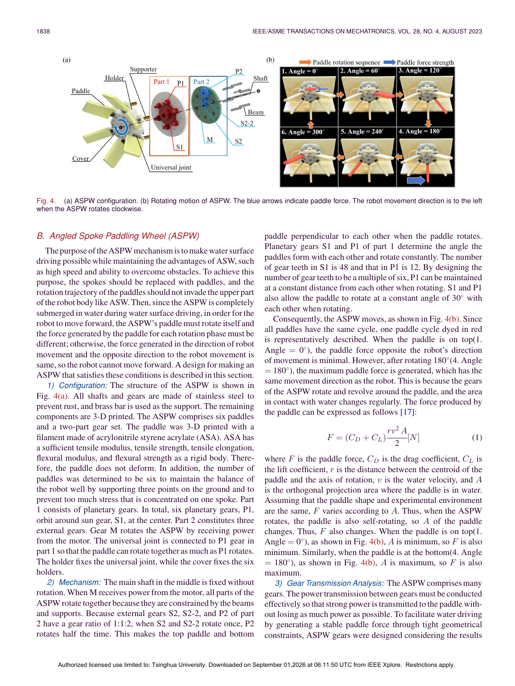
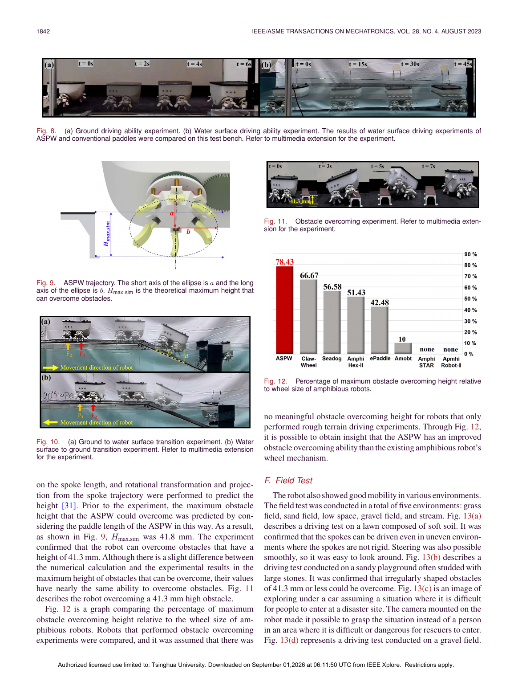
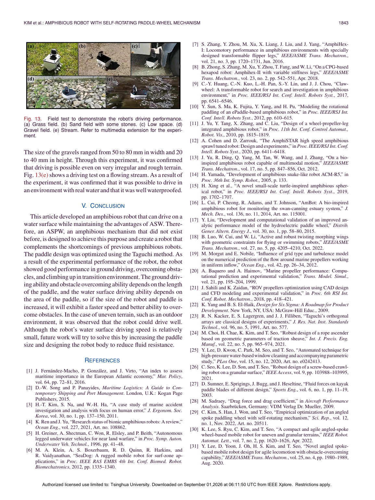

# 自旋转桨轮两栖机器人

> Chaewon Kim, Kyungwook Lee, Sijun Ryu, TaeWon Seo. “Amphibious Robot With Self-Rotating Paddle-Wheel Mechanism.” *IEEE/ASME Transactions on Mechatronics*, 28(4), 2023, 1836–1843. DOI: 10.1109/TMECH.2023.3273240。  
> [打开原文](<../01 papers/Amphibious_Robot_With_Self-Rotating_Paddle-Wheel_Mechanism.pdf>)

## 一句话概括

论文把“越障能力强的斜辐条轮”改造成会自转的桨轮 ASPW，使桨叶在轮体完全浸没时仍能形成方向不对称的水动力，从而兼顾陆地、浅水、岸滩过渡与障碍跨越。

## 研究问题

海事事故现场可能有狭窄通道、坠落物和水陆交界，救援人员与常规船只难以进入。已有两栖机器人往往在水面速度、地面机动、越障、体积和传感器视野之间顾此失彼。作者要解决的是：能否仅用一套紧凑轮系，同时实现陆地行驶、水面推进和较强越障？

## 核心机制

ASPW 由 6 个桨叶和两级齿轮组构成。轮毂转动时，行星齿轮与外齿轮约束桨叶同步自转，使桨叶迎水投影面积随相位周期变化：上方回程阶段投影面积最小，反向阻力小；下方做功阶段投影面积最大，正向推力大。净推进力因此不再互相抵消。

齿轮设计的关键点是：外齿轮组采用 1:1:2 关系，使顶部与底部桨叶互相垂直；太阳轮 48 齿、行星轮 12 齿，使 6 个桨叶保持稳定的 30°相位间隔。主体金属件采用不锈钢/黄铜，桨叶用 ASA 材料 3D 打印。

*图：原文第 3 页，展示 ASPW 构型、齿轮约束和桨叶一周内的自转过程。*

## 桨叶优化

由于新机构的流体作用呈强周期性，作者认为高成本数值仿真并不划算，转而采用田口法 L9(3⁴) 做实验优化。四个设计变量是 X/Y 方向曲率、桨叶端部形状和安装倾角，外部条件是 60/90/120 rpm。

最优组合为：X 向曲率半径 37.5 mm、Y 向曲率半径 25 mm、矩形端部、0°倾角。在 120 rpm 下，推力比基础桨形提升 18.27%。这部分的价值不只在参数本身，更在于展示了“难建模新机构”可用稳健试验设计快速收敛。

## 实验与主要结果

| 工况 | 结果 |
|---|---|
| 平地速度 | 60/90/120/135 rpm 时平均为 0.19/0.31/0.40/0.47 m·s⁻¹；与椭圆轮迹模型预测一致 |
| 水面速度 | 60/90/120/135 rpm 时为 0.025/0.049/0.077/0.10 m·s⁻¹ |
| 普通桨轮对照 | 在相同完全浸没条件下无法产生前进位移，支持“自转造成净推力”的机理解释 |
| 陆→水过渡 | 最大可通过约 25°坡面 |
| 水→陆过渡 | 最大可通过约 20°坡面 |
| 越障 | 理论 41.8 mm，实测 41.3 mm，二者接近 |
| 野外验证 | 草地、沙地、低矮空间、碎石地与有流动水的溪流均完成行驶 |

*图：原文第 7 页，集中给出陆地/水面、过渡坡面和 41.3 mm 障碍实验。*

*图：原文第 8 页，五类实地环境验证。*

## 如何理解这篇论文的贡献

1. 贡献是“被动机械调制”，而不是增加一个桨叶舵机。桨叶姿态由轮内齿轮自动约束，控制系统仍可保持简单。
2. 作者用“普通桨轮完全浸没不前进”作为对照，直接验证了自转桨叶的必要性。
3. 地面速度模型与实验高度吻合，越障理论值也接近实测，说明机构的几何部分可预测；水动力部分则主要依赖实验优化。

## 局限与批判性阅读

- 水面最高速度仅 0.10 m·s⁻¹，适合低速侦察，不足以证明其在强流、浪涌或风浪条件下的救援能力。
- 论文的水上性能主要以直线速度表征，缺少转向半径、侧风/横流稳定性、能耗和续航比较。
- 过渡坡度结果受浮力、重心和轮地摩擦共同影响，但样机尺寸、载荷变化对极限坡度的敏感性没有系统展开。
- 齿轮和万向节数量较多，水下长期运行时的泥沙侵入、腐蚀、密封、磨损与维护成本仍需耐久试验。

## 可复用的设计启发

- 对周期运动机构，可优先思考“让有效面积/力臂随相位被动变化”，而不是直接增加执行器。
- 对机理难建模但试制成本低的对象，田口法适合先筛选主效应；后续可再用响应面或贝叶斯优化做精细搜索。
- 下一步实验应加入单位距离能耗、静水/流场下的姿态稳定性、转弯性能、密封寿命和载荷敏感性，才能从概念样机走向救援装备。

