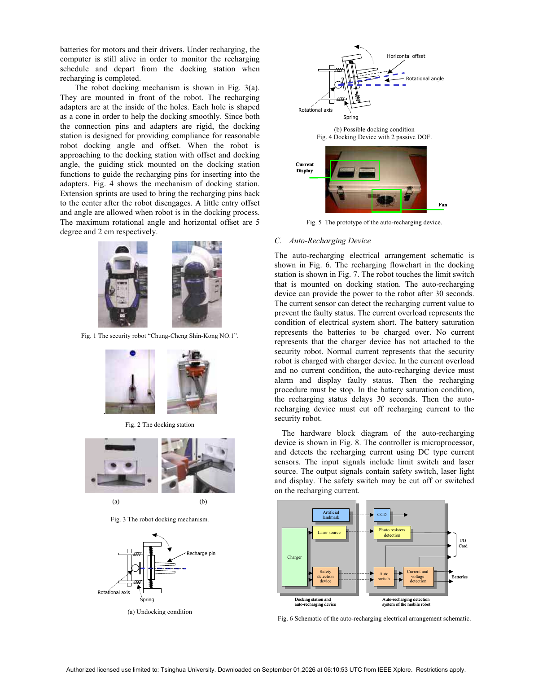
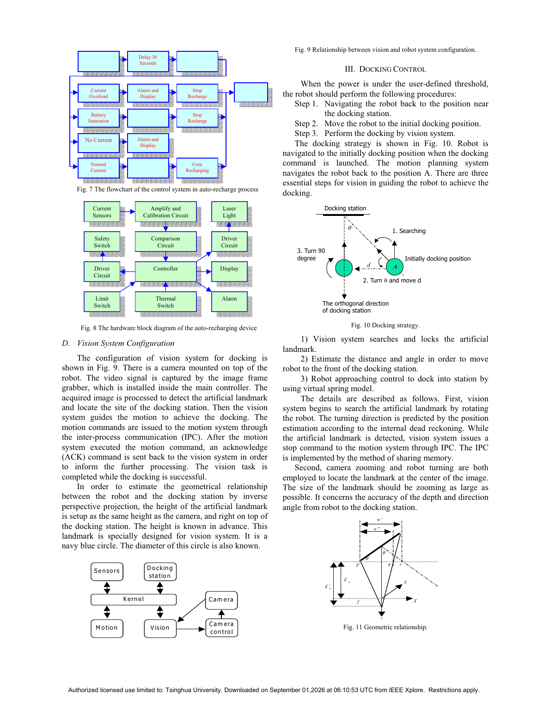
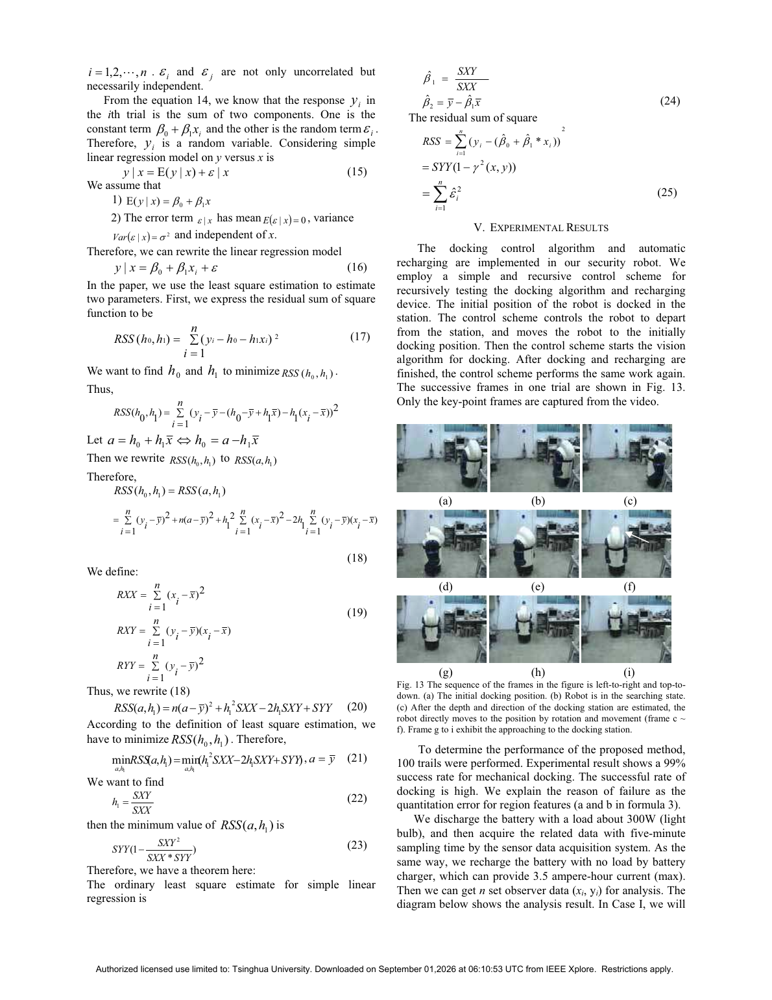

# 安防机器人自动对接与充电

> Ren C. Luo, Chung T. Liao, Kuo L. Su, Kuei C. Lin. “Automatic Docking and Recharging System for Autonomous Security Robot.” *2005 IEEE/RSJ International Conference on Intelligent Robots and Systems (IROS)*, 2005. DOI: 10.1109/IROS.2005.1545197。  
> [打开原文](<../01 papers/Automatic Docking and Recharging System for Autonomous Security Robot.pdf>)

## 一句话概括

论文通过“人工视觉地标 + 逆透视位姿估计 + 虚拟弹簧控制 + 两自由度被动柔顺接口”，构成从低电量判断到自动靠站、接触和安全充电的完整闭环，100 次试验机械对接成功率为 99%。

## 为什么这篇老论文仍值得读

它并不依赖复杂学习模型，却把感知、控制、机械容错、电气安全和电量预测串成一个可工作的系统。很多现代对接算法只讨论定位精度，而本文提醒我们：对接成功率往往来自“算法精度 × 机构容差 × 接触检测 × 异常处理”的乘积。

## 系统构成

- 安防机器人搭载 CCD、超声、红外、无线网络、电源传感器等；计算平台为 Pentium III 933 MHz/512 MB RAM。
- 充电站提供两组电源：12 V/最大 30 A 给计算机和传感器，36 V/最大 15 A 给电机及驱动。
- 机器人端采用锥形导入口，站端充电针由弹簧复位，形成 2 个被动自由度；允许最大约 5°角度误差和 2 cm 水平偏差。
- 限位开关确认接触后等待 30 s 再上电；电流检测区分过流、无电流、正常充电和电池饱和，并执行报警/断电。

*图：原文第 2 页。算法之外的锥形导向、弹簧复位和双电压充电回路，是高成功率的重要组成。*

## 对接流程

1. 电量低于用户阈值后，利用已有导航系统返回充电站附近的初始点。
2. 机器人旋转搜索海军蓝色圆形人工地标，并通过相机变焦使其尽量占满视野。
3. 已知地标真实直径和安装高度，利用其在图像中的椭圆宽高做逆透视估计，得到距离与偏航角。
4. 先转向并平移到充电站正前方，再采用虚拟弹簧模型完成末端接近。
5. 接触后由限位开关与电流传感器接管充电安全逻辑。

*图：原文第 3 页，包含自动充电状态逻辑和“搜索—正对—靠近”策略。*

## 虚拟弹簧模型

作者把机器人与对接站想象成由一根可伸缩、可弯曲的弹簧连接。视觉系统给出距离 d 和角度 φ：平移弹力与 d 成正比，弯曲恢复力与 φ 成正比；结合机器人质量、转动惯量和粘性阻尼，推导出线速度与角速度，再映射为左右轮速度。

这个模型的工程意义是把“位置误差”直接变成具有阻尼的连续控制量。与若干离散转向规则相比，它在末端接近时更平滑，也更容易与机械柔顺共同吸收小误差。

## 电量预测

论文采集电池在约 300 W 负载下的放电数据，以及最大 3.5 A 充电条件下的数据，采用最小二乘拟合电压—时间曲线。作者比较多项式阶次后认为三阶曲线对充放电过程较合适，并设置 11 V 阈值触发返航。

这里要注意：文中先完整推导了线性回归，再实际比较多阶多项式。真正可迁移的思想是“用在线采样估计剩余可用时间，并把返航能耗计入阈值”，而不是固定照搬 11 V。

## 主要结果

- 进行了 100 次循环试验：机器人离站、回到初始对接位置、视觉搜索、靠站、充电，再重复。
- 机械对接成功率 99%；作者把失败归因于地标区域特征量化误差。
- 图像序列显示机器人完成搜索、距离/方向估计、横向修正和末端靠站。
- 论文验证了充放电曲线拟合，但没有给出不同初始位姿下的时间、误差分布或置信区间。

*图：原文第 5 页，关键帧从左到右、从上到下展示一次对接过程。*

## 局限与批判性阅读

- 依赖尺寸、颜色和高度均已知的人工地标；照明变化、遮挡、地标污损与相机曝光会影响估计。
- “99%”是单一系统和固定实验环境的结果，论文未说明初始角度/距离的采样分布，难以判断工作域边界。
- 电池模型用电压—时间拟合，未显式纳入温度、老化、动态负载和回站路径能耗。
- 站端被动柔顺只有 5°和 2 cm 容差；它能兜底小误差，却不能替代全局定位与避障。

## 对今天系统设计的启发

现代实现可以把人工地标替换为 AprilTag、目标检测或点云几何，但应保留本文的三层容错思想：感知层把机器人送入捕获区，控制层平滑收敛，机械层吸收末端残差。充电端还应增加接触电阻/温升监测，并用 SOC/SOH 估计代替单一电压阈值。

