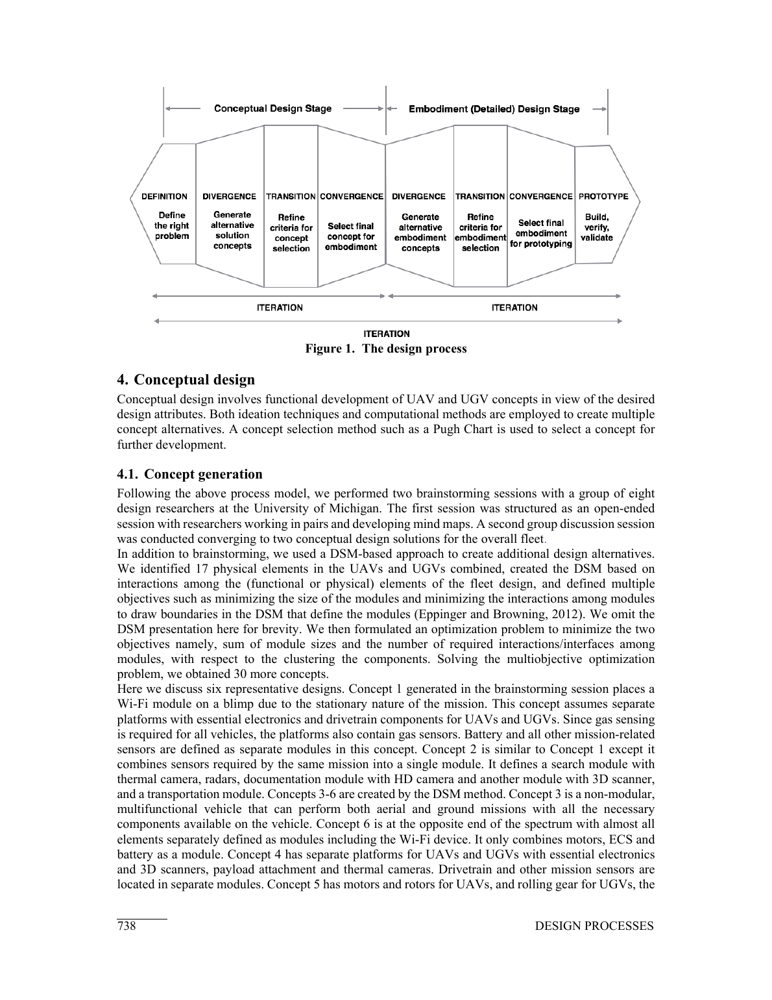
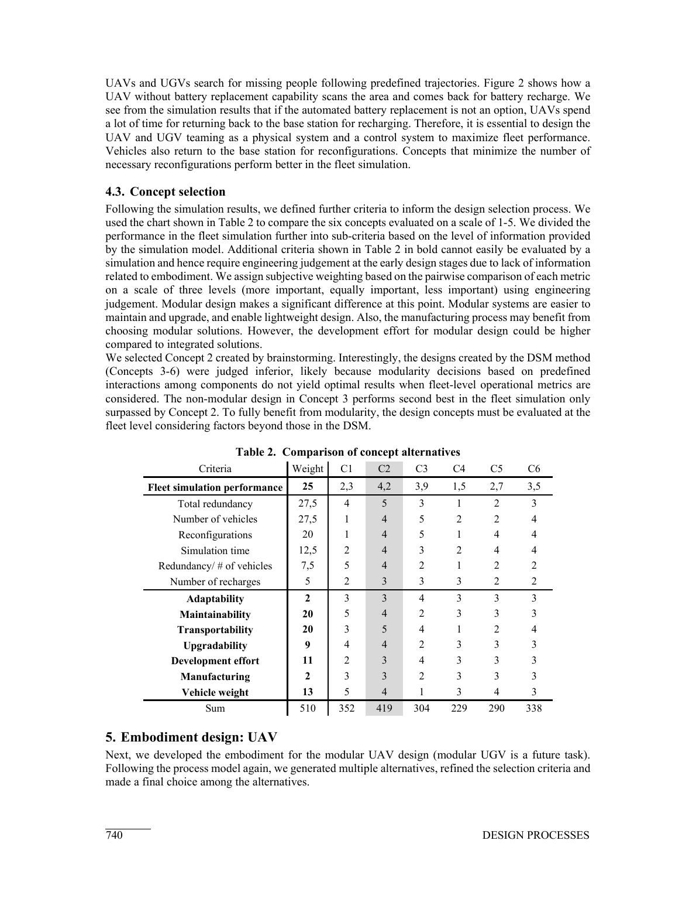
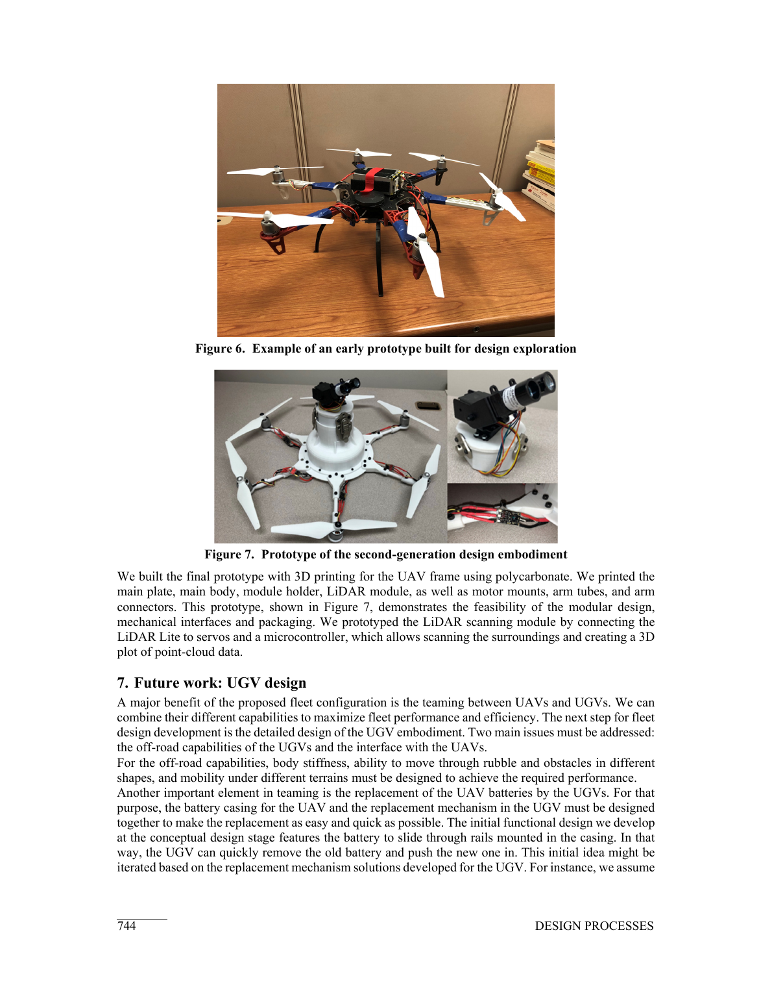

# 灾害救援模块化空地车队的集成系统设计

> A. C. Gärtner, D. Ferriero, A. E. Bayrak, P. Y. Papalambros. “Integrated System Design of a Modular, Autonomous, Aerial and Ground Vehicle Fleet for Disaster Relief Missions—A Case Study.” *International Design Conference—DESIGN 2018*, 2018. DOI: 10.21278/idc.2018.0477。  
> [打开原文](<../01 papers/INTEGRATED SYSTEM DESIGN OF A MODULAR, AUTONOMOUS, AERIAL AND GROUND VEHICLE FLEET FOR DISASTER RELIEF MISSIONS - A CASE STUDY.pdf>)

## 一句话概括

论文证明：模块划分不能只依据部件之间的静态交互，还要把 UAV/UGV 车队放入随时间演化的救灾任务中评价；模块化与自主协同的真正收益，来自 UGV 自动更换 UAV 电池等车队级行为。

## 场景与需求

作者构造了类似 2016 年意大利 Amatrice 地震的场景：约 4 km² 城区、15,000 人口、50 人失踪、道路与通信受损、建筑倒塌且存在燃气泄漏。车队需要完成五类任务：灾情记录、搜救、物资/废墟运输、通信恢复和气体检测。

由此得到的关键设计约束包括：单车至少工作 30 min、总体任务持续 48 h、电池可更换、UGV 可无人介入地为 UAV 换电；同时要求便于运输、轻量、耐候、易修复，并支持 GPS 拒止环境中的自主导航。

## 八阶段设计流程

作者把“定义—发散—过渡—收敛—原型”的简化流程细化为八阶段：问题定义；概念设计的发散、过渡、收敛；实体设计的发散、过渡、收敛；最终原型。概念层与实体层都允许迭代，这使模块边界、任务性能和结构实现可以互相反馈。

*图：原文第 4 页，展示扩展后的设计流程，以及从需求进入概念方案的路径。*

## 概念生成与车队仿真

研究用两条路线生成方案：8 名设计研究者分组头脑风暴；以及基于 DSM（设计结构矩阵）对 17 个物理元素做多目标聚类，目标是减小模块尺寸和模块间接口数。DSM 路线产生 30 个概念，论文选出 6 个代表方案，覆盖从高度集成到高度模块化的光谱。

随后建立时间步进车队仿真。失踪人员、倒塌建筑和燃气泄漏位置随机，车队完成搜索、救援和记录任务。每个概念执行 100 次蒙特卡洛模拟，评价指标包括：总冗余、车辆数量、单车冗余、重构次数、找到 50 名失踪人员的总时间和充电次数。

一个关键观察是：不可换电 UAV 频繁返回基地充电，显著浪费任务时间；方案若减少不必要的模块重构，也会获得更好的车队性能。

## 方案选择结果

作者加入适应性、维护性、运输性、升级性、开发工作量、制造和重量等工程判断指标，再用加权表选型。最终选择的是头脑风暴产生的 Concept 2，总分 419；非模块化的 Concept 3 在车队仿真中排名第二，而 DSM 生成的方案整体并未占优。

这并不意味着 DSM 无用，而是说明 DSM 只表达预先定义的部件交互，难以覆盖任务触发、时间成本、车辆调度和自主换电等运行层属性。

*图：原文第 6 页。Concept 2 的综合评价最高；表格也展示了性能与工程判断如何合并。*

## UAV 实体设计

- 构型：在四、六、八旋翼中选择六旋翼，平衡单电机故障鲁棒性、载荷、尺寸和机动性。
- 动力：通过 eCalc 迭代电机、桨、ESC、机架和电池；最终示例选用 DJI Snail 2305 电机、5048S 三叶桨和 7.4 V/3200 mAh 电池。
- 控制：Pixhawk 2.1 负责飞控，Raspberry Pi 负责自主功能；传感器包括 LiDAR Lite、高清相机、热像仪与 MQ-2 气体传感器。
- 模块接口：从螺钉、卡环、卡口、快接等候选中选择锁扣式接口。
- 二代机架：由六边形三层开放结构，迭代为圆形封闭抗扭结构；锁扣从 6 个减至 3 个，并根据有限元高应力区增加支撑。
- 换电：UAV 直接落在电池壳体上，电池沿导轨抽换，为 UGV 自动更换留出接口。

*图：原文第 10 页，展示从低保真探索原型到二代聚碳酸酯 3D 打印样机。*

## 贡献与局限

主要贡献不是某一台无人机，而是把“车队运行仿真”插入模块化设计决策中，并明确指出自主性与模块化存在协同效应。

局限也很明显：UGV 尚未完成实体设计；自主换电只做到接口与概念层；车队仿真参数、控制策略和现实救灾不确定性的披露有限；最终原型主要验证机械接口和封装可行性，并未完成完整任务级实证。

## 可复用的研究框架

如果用于自己的课题，可以沿着以下闭环展开：

`任务场景 → 可量化需求 → 多种模块架构 → 任务级蒙特卡洛仿真 → 加权选型 → 实体设计/有限元 → 原型试验 → 回写模型`

尤其值得复用的是评价层级：模块边界的好坏不应只由“接口少”决定，还要看它让整个系统在任务时间、能源、冗余、维护和调度上付出了什么代价。

