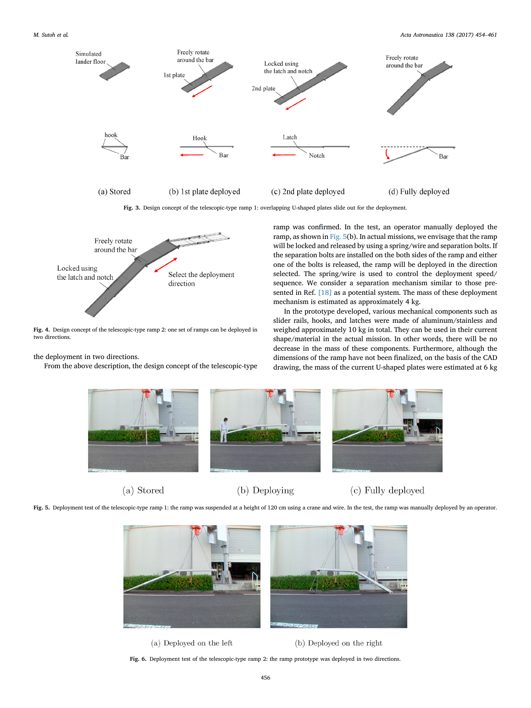
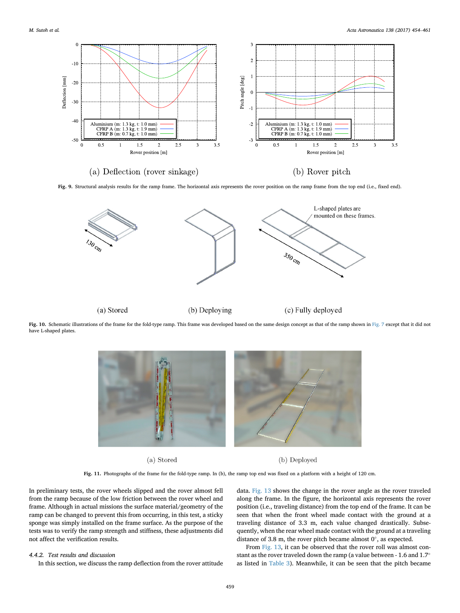
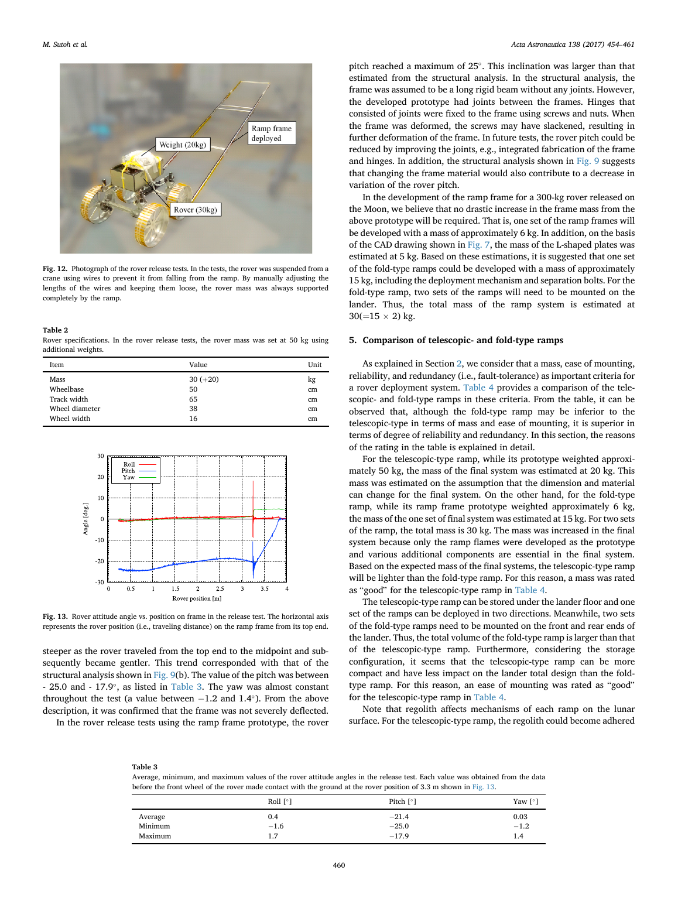

# JAXA 月球着陆任务的月球车部署系统

> Masataku Sutoh, Takeshi Hoshino, Sachiko Wakabayashi. “Rover deployment system for lunar landing mission.” *Acta Astronautica*, 138 (2017), 454–461. DOI: 10.1016/j.actaastro.2017.06.019。  
> [打开原文](<../01 papers/Rover deployment system for lunar landing mission.pdf>)

## 一句话概括

论文比较了伸缩式和折叠式两种 3.5 m 月球车下行坡道：伸缩式更轻、更紧凑且可双向展开，折叠式虽需双套、总质量更大，却因机构更简单、故障冗余更高而被认为更适合任务。

## 任务约束

目标是让约 300 kg 月球车从离地 1.2 m 的着陆器平台安全驶下。月球重力约为地球的 1/6，因此坡道设计载荷可用地面约 50 kgf 进行等效验证。为满足月球车通过能力，坡角取 20°，所需长度约 3.5 m；但发射时必须收拢并承受振动。

两种储存长度分别为：伸缩式 1.8 m，折叠式 1.3 m。共同评价指标是质量、安装便利性、可靠性、冗余性、地形适应和月尘影响。

## 方案 A：伸缩式坡道

多个 U 形板重叠储存，沿侧壁滑轨依次伸出。第一块通过钩与着陆器横杆锁定，第二块通过锁扣/缺口与前一块固定，最后整条坡道在自重下绕横杆倾斜。其突出优点是一套坡道可沿相反方向展开，着陆后可以选择地形更安全的一侧。

原型收拢/展开尺寸为 1.8 × 0.6 m 和 3.5 × 0.6 m，2 mm 铝板原型重约 50 kg。作者估算若换用 CFRP 板并优化结构，飞行版单套可约 20 kg，其中展开机构约 4 kg、滑轨/钩/锁扣等约 10 kg。

*图：原文第 3 页。伸缩结构的最大吸引力是“一套机构、两个可选方向”。*

## 方案 B：折叠式坡道

两次折叠的 L 形路面板由内向外展开。展开完成后，相邻框架端面互相接触并承担竖向载荷。结构分析把单侧框架等效为“一端固支、一端简支”的梁，叠加前后轮集中载荷，计算挠度与月球车俯仰变化。

分析对象为 3.5 m 长、50 × 20 mm 空心矩形截面，比较 1 mm 铝、同质量 CFRP A 和同厚度 CFRP B：

- 铝框最大挠度约 33 mm，理论俯仰变化约 ±1°。
- 同质量 CFRP 可提高刚度；同厚度 CFRP 的质量约为铝的 55%，且俯仰变化更小。
- 铝框架原型质量 5.8 kg；加上 L 形面板和展开机构，单套飞行版估计约 15 kg。

*图：原文第 6 页，包含挠度/俯仰曲线和 3.5 m 折叠框架。*

## 月球车下行试验

地面试验采用 30 kg 四轮车再加 20 kg 配重，等效 300 kg 月球车在月面产生的重力载荷；坡度 20°、速度 1 cm·s⁻¹。为防跌落，吊车钢索保持松弛，只提供安全保护；由于轮—框架摩擦不足，试验临时加装黏性海绵。

实测滚转约 −1.6°至 1.7°，偏航约 −1.2°至 1.4°；俯仰为 −25.0°至 −17.9°。最大俯仰比理想梁模型预期更大，作者认为主要来自铰链螺钉松弛和连接处附加变形，而不是框架本体强度不足。

*图：原文第 7 页。试验揭示了“理想连续梁”与“带铰链真实结构”的差异。*

## 为什么最后偏向折叠式

| 维度 | 伸缩式 | 折叠式 |
|---|---|---|
| 估计总质量 | 约 20 kg/单套 | 约 15 kg/套，但需两套，共约 30 kg |
| 收纳/安装 | 更紧凑，可藏于底板下 | 占空间更大，需在两侧安装 |
| 地形方向选择 | 单套可双向部署 | 每套单向，靠两套冗余 |
| 月尘敏感性 | 滑轨可能被月壤卡滞 | 铰链结构相对直接 |
| 故障后果 | 单套失败则无法下车 | 一侧失败仍可用另一侧 |

航天任务把可靠性和冗余性的优先级放在质量与安装便利性之上，所以作者把折叠式视为更有前景的方案。这是典型的“不是单项最优，而是任务风险最优”。

## 局限与后续工作

- 两种坡道均为手动展开原型，真实分离螺栓、弹簧/钢索、速度控制和月面锁定尚未形成完整飞行机构。
- 地面等效仅匹配静态重力载荷，不能完全复制月面接触、惯性、真空润滑、热循环和月尘。
- 折叠坡道的临时海绵说明路面摩擦设计仍未闭环；真实踏面材料和轮齿啮合需要单独验证。
- 最值得继续的方向是铰链一体化、CFRP 优化、月尘容错和部署动力学仿真，并以失效模式/Fault Tree 驱动双侧冗余设计。

