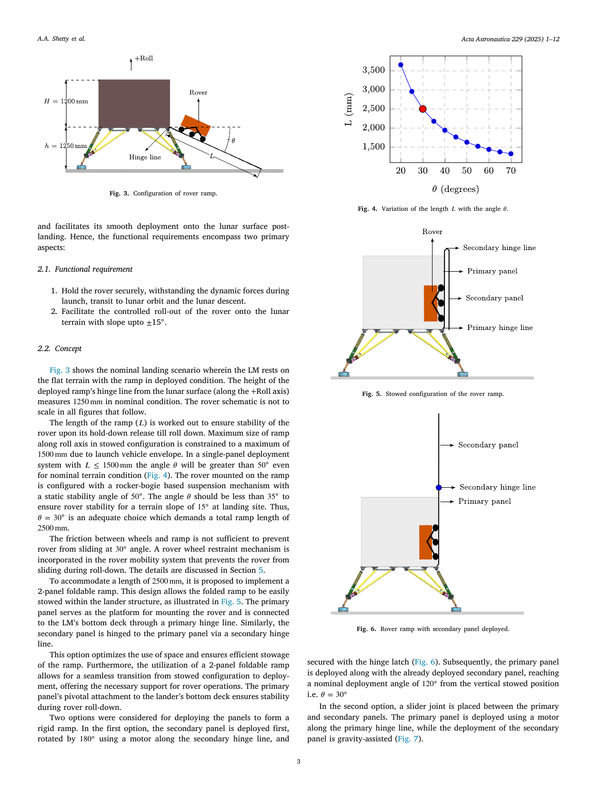
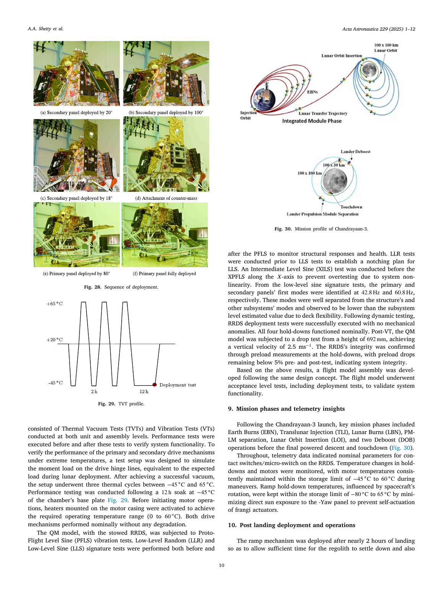
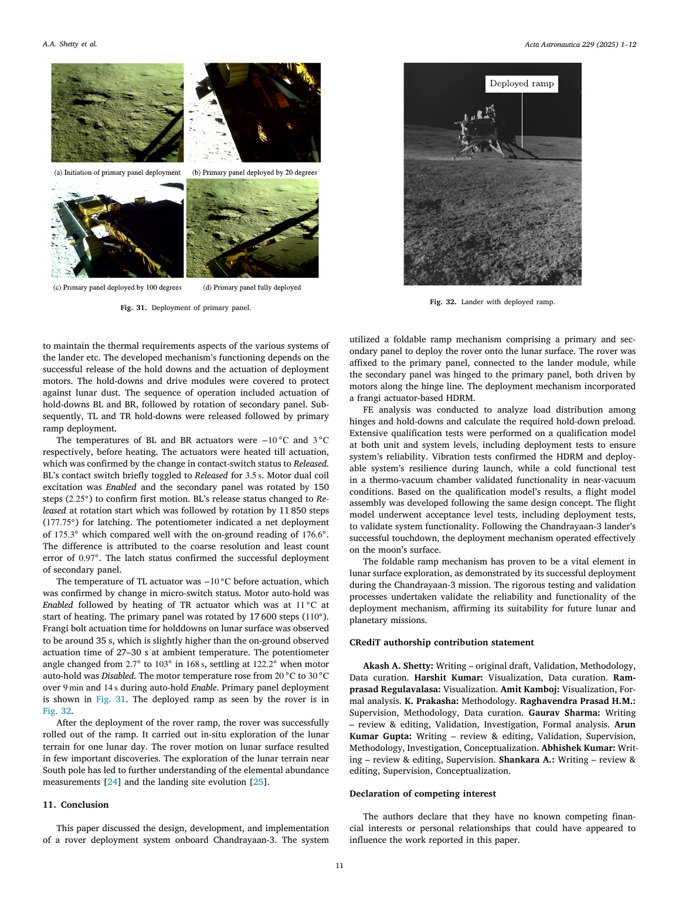

# “月船 3 号”月球车坡道：从概念到月面执行

> Akash A. Shetty et al. “Rover ramp deployment system for Chandrayaan-3: Concept, design, development and operations.” *Acta Astronautica*, 229 (2025), 1–12. DOI: 10.1016/j.actaastro.2024.12.014。  
> [打开原文](<../01 papers/Rover ramp deployment system for Chandrayaan-3 Concept, design,development and operations.pdf>)

## 一句话概括

论文完整记录了一个飞行级机构的闭环：受空间包络限制的双面板折叠坡道，通过 SMA Frangibolt 解锁、谐波减速步进电机展开、Kevlar 绳约束月球车下滑，经有限元、热真空、振动、跌落和地面重力补偿试验后，在 2023 年月面成功工作。

## 设计难题

“月船 3 号”着陆器顶板已被科学载荷占用，26.5 kg 的 Pragyan 月球车只能竖直装在着陆器内部象限，并直接固定在坡道主面板上。坡道因此同时承担两种角色：发射/转移/着陆阶段的承力结构，以及着陆后的展开通道。

月球车静态稳定角约 50°。为应对着陆点 ±15°地形坡度，作者把坡道名义坡角限制为 30°，留出约 20°稳定裕度。铰链离月面约 1250 mm，因此总坡道需约 2500 mm，而发射包络只允许单段不超过 1500 mm，最终采用主、次两面板折叠方案。

## 概念选择

作者比较两种展开方式：

- 方案 1：次面板由电机先转 180°并锁定，再由主铰链把主面板、月球车和次面板整体放下。
- 方案 2：主面板电机驱动，次面板依靠重力沿滑轨展开。

方案 2 受滑动摩擦、着陆坡度和局部地形影响，若为不确定性再增加执行器，会提高复杂度。方案 1 的转动过程只要电机有足够重力矩裕度，受地形影响较小，因此被采用。

*图：原文第 3 页。2500 mm 总长与 1500 mm 收纳包络的矛盾，直接驱动了双面板构型。*

## 关键子系统

### 面板与承力路径

主面板为 1130 × 870 × 40 mm，AA-6061 铝蜂窝/CFRP 面板，质量 4.4 kg；次面板为 1310 × 930 × 15 mm，质量 1.5 kg。两者均设 CFRP 导轨。月球车以 3 个点固定在主面板，坡道以 4 个保持点固定在着陆器，布置上尽量让坡道保持点对齐月球车保持点，以缩短载荷路径。

### 保持与释放

4 个非爆炸式 SMA Frangibolt HDRM 在通电加热后伸长并拉断带缺口钛合金螺栓；弹簧提供初始分离。释放顺序是底部 BL/BR → 次面板展开 → 顶部 TL/TR → 主面板展开。接触开关回报释放状态，执行器储存温度必须受控以避免自触发。

### 驱动与下滑约束

主、次铰链均使用步进电机与谐波减速器。主面板展开经历“主动抬离不稳定平衡点”和“控制重力下放”两个阶段；理论最大需求力矩约 50 N·m，驱动器通电保持力矩为 75 N·m。

30°坡面上的轮—面摩擦不足以阻止月球车滑落，因此后轮缠绕约 2 m Kevlar 绳。车轮滚动时绳索逐步放出，在后轮接触月面前从轮齿槽脱开，实现无需额外主动制动器的速度约束。

## 分析与地面验证

- 有限元按三个方向分别施加 25 g 准静态惯性载荷；保持点承担 Yaw 方向约 92%载荷，峰值拔出力 3527 N，对应螺栓预紧力取 5400 N。
- 刚性边界模型估计主/次模态为 61/73 Hz；系统振动试验因着陆器面板柔性，实测首模态约 42.8/60.8 Hz。
- 用氦气球抵消地球重力：次面板所需总升力 43.9 N；主面板连同 22 kg 配重后所需总升力 404.2 N。
- 热真空进行了 −45°C 至 65°C 的 3 个循环，并在 −45°C 浸泡 12 h 后做性能试验；驱动机构无明显退化。
- 原型飞行级正弦振动后 4 个保持点均正常释放；692 mm 跌落试验达到 2.5 m·s⁻¹，前后预紧力下降小于 5%。

*图：原文第 10 页，体现从部组件试验到系统环境验证的证据链。*

## 月面实际执行

着陆约 2 h 后，待月尘沉降且热状态合适，系统开始展开。次面板指令 12,000 步，其中先转 150 步确认起动，再转 11,850 步；电位计测得净展开 175.3°，与地面 176.6°接近。月面 Frangibolt 动作约 35 s，略慢于室温地面 27–30 s。

主面板转动 17,600 步（110°指令）；电位计在 168 s 内由 2.7°变至 103°，取消电机保持后稳定在 122.2°。月球车随后成功驶出，并完成一个月昼的巡视。

*图：原文第 11 页，左侧为主面板展开，右侧为月面实际部署完成状态。*

## 最有价值的工程经验

1. 把承力与部署合并：月球车直接固定在主面板，减少独立承力支架，但也让面板和保持系统承受全任务载荷。
2. 采用可观测的顺序机构：接触开关、电位计、温度和电机状态让地面团队能逐步确认再推进。
3. 地面低重力模拟匹配的是“铰链力矩”，不是简单减轻总质量；氦气球连接位置和附加夹具质量都进入力矩平衡。
4. 分析值与系统试验值不一致并非失败。首模态下降揭示了着陆器 deck 柔性，系统级试验正是为捕捉组件边界条件遗漏。

## 局限与可追问问题

论文证明了单次任务成功，但统计可靠性仍主要来自鉴定流程与设计裕度，无法由一次月面部署给出。文中对月尘罩的结构与密封效果、Kevlar 绳释放的月面遥测、坡面接地状态和月球车实际下行速度披露有限。后续研究可重点比较：多次可复用部署、不同着陆倾角下的接触动力学，以及保持点/电机/传感器的故障容错策略。

