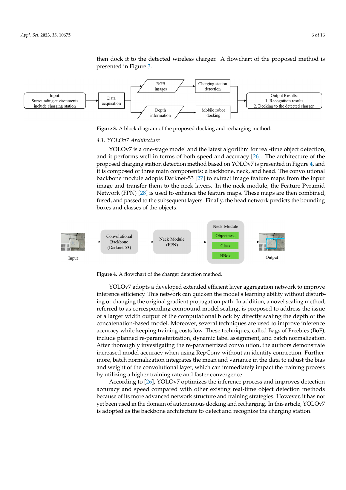
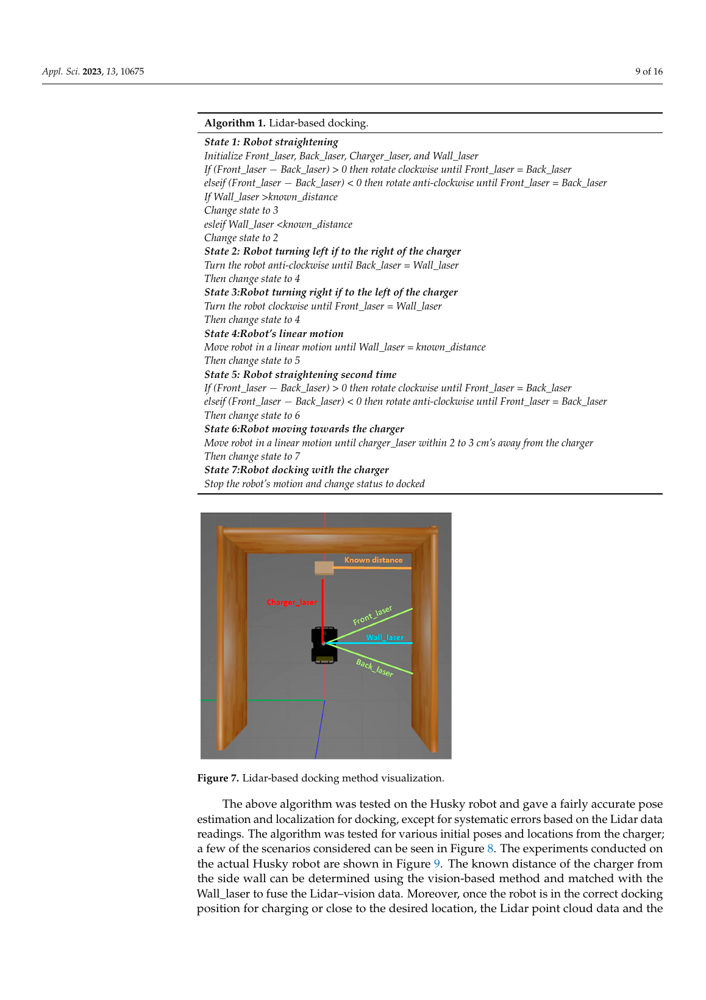
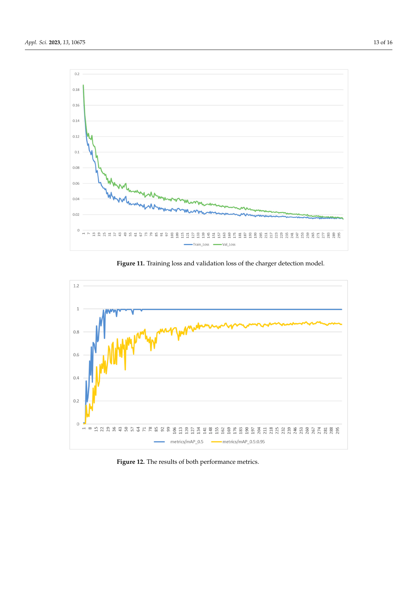

# 面向自主制造的视觉—激光雷达移动机器人对接充电

> Feiyu Jia, Misha Afaq, Ben Ripka, Quamrul Huda, Rafiq Ahmad. “Vision- and Lidar-Based Autonomous Docking and Recharging of a Mobile Robot for Machine Tending in Autonomous Manufacturing Environments.” *Applied Sciences*, 13(19), 10675, 2023. DOI: 10.3390/app131910675。  
> [打开原文](<../01 papers/Vision- and Lidar-Based Autonomous Docking and Rechargingof a Mobile Robot for Machine Tending in AutonomousManufacturing Environments.pdf>)

## 一句话概括

系统让 YOLOv7 从相机图像中回答“正确充电站在哪里”，再让 3D 激光雷达和七状态几何控制回答“怎样精确靠上去”；充电站检测在验证集达到 99.4% mAP@0.5，真实移动场景平均识别准确率为 95%。

## 研究动机

制造环境中的移动机器人要连续执行机床上下料等任务，必须自主寻找充电站并精确对接。单一传感器各有短板：相机信息丰富且便宜，但怕低照度、运动模糊和视场盲区；激光雷达测距精确、不依赖照明，但点云稀疏、成本和计算负担较高。作者因此用视觉做语义识别，用激光雷达做末端几何定位。

实验平台是 Clearpath Husky UGV，搭载 Hikvision 相机、Ouster 3D 激光雷达并运行 ROS Melodic；无线充电器安装在带侧壁的定制舱体内。

## 方法架构

流程分三部分：相机/雷达采集环境数据；YOLOv7 识别无线充电站；激光雷达根据墙面和充电器距离调整机器人姿态并完成靠站。相机内参和雷达坐标通过变换矩阵关联，可由检测框映射目标的 3D 坐标。

*图：原文第 6 页，给出整体框图与 YOLOv7 充电站检测流程。*

## 七状态激光雷达对接

点云被滤出四个距离量：前向斜线 `Front_laser`、后向斜线 `Back_laser`、侧墙 `Wall_laser` 和充电器 `Charger_laser`。控制状态机如下：

1. 比较前/后斜线距离，先把机器人调正。
2. 根据 `Wall_laser` 与已知目标距离判断机器人在充电器左侧还是右侧。
3. 向相应方向转 90°附近，使一条斜线与墙距相等。
4. 直线横移到目标侧向位置。
5. 再次调正，使机器人与充电器正对。
6. 直行至距离充电器 2–3 cm。
7. 停车并把状态置为 docked。

*图：原文第 9 页，状态机把复杂的二维位姿修正拆为可解释的旋转和平移。*

## 数据集与模型训练

由于没有公开的同类充电站数据集，作者采集 240 张 1920 × 1018 图像：160 张训练、40 张验证、40 张测试，使用 LabelImg 标注。数据增强包括旋转、平移、缩放、垂直翻转、Gaussian 模糊和噪声。模型基于 COCO 预训练权重做迁移学习。

训练硬件为 RTX 3090、Threadripper 3970X 和 128 GB RAM；学习率 0.001、动量 0.9、batch size 16，并比较 100–300 以上 epoch。约 300 epoch 时训练/验证损失稳定；再继续训练，验证损失回升，出现过拟合。

## 结果

| 指标 | 结果 |
|---|---|
| 验证集 mAP@0.5 | 99.4% |
| 验证集 mAP@0.5:0.95 | 86.5% |
| 真实移动视频平均识别准确率 | 95% |
| 末端停止距离 | 充电器前 2–3 cm（算法设定） |

*图：原文第 13 页，训练损失在约 300 epoch 收敛，并给出检测性能。*

## 贡献如何评价

论文的合理分工是最大亮点：视觉负责在多个外观相近目标中选择正确充电站，点云负责精确距离与姿态控制。七状态控制器规则透明，易于在 ROS 中调试，比端到端策略更容易定位失败原因。

与 2005 年的视觉地标对接论文相比，本研究不要求固定色彩图案，目标识别更灵活；但末端几何控制仍依赖人工设计的充电舱侧壁，说明“深度学习识别”没有消除环境工程化要求。

## 局限与批判性阅读

- 数据集仅 240 张、单类目标且来自特定场景，99.4% mAP 不代表跨工厂、跨相机或跨充电器泛化。
- 文中报告了识别准确率，却没有系统给出端到端对接成功率、对接耗时、初始位姿工作域和重复试验统计。
- 方法假设充电站位于封闭空间并有可测侧墙；开放式站点或动态遮挡会破坏 `Wall_laser` 逻辑。
- 论文称融合可降低计算成本，但缺少与纯点云、纯视觉方案的延迟、算力和能耗对照。
- 低照度和运动模糊仍会影响检测；相机—雷达标定在论文中更像方法框架，作者也把更完整标定列为后续工作。

## 可复现与改进建议

复现时应先做三组基线：仅视觉、仅雷达、视觉+雷达；每组在统一的初始距离/角度网格上至少重复若干次，报告成功率、耗时、最终横向/角度误差和计算延迟。工程升级可加入 AprilTag 或主动红外作为低照度备份，采用自动外参标定、鲁棒平面拟合和接触/充电电流确认，最终把“检测成功”提升为“真正建立稳定充电连接”。

